<div align="center">

# Blockletter

### Email newsletters that assemble themselves from your app's data.

A drag-and-drop newsletter editor for React, an email-safe renderer that runs anywhere
JavaScript does, and blocks that fill themselves from your own records.

**[Live demo](https://subterra-technologies.github.io/blockletter/)** ·
[Rendered email](https://subterra-technologies.github.io/blockletter/?render=email) ·
[Architecture](docs/ARCHITECTURE.md) · [Email clients](docs/COMPATIBILITY.md) ·
[Roadmap](docs/PLAN.md) · [Contributing](CONTRIBUTING.md)

[](https://github.com/Subterra-Technologies/blockletter/actions/workflows/ci.yml)
[](LICENSE)

<br>

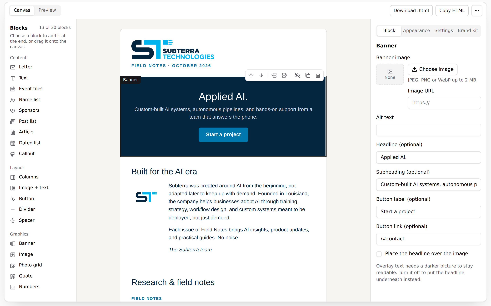

</div>

> **Status: pre-release.** The [live demo](https://subterra-technologies.github.io/blockletter/)
> runs everything shown here. The packages are not on npm yet; they publish with the first release.
> Until then, clone the repository to build with them.

---

Most email builders hand your users a blank canvas. Blockletter hands them an issue that is
already mostly written. Your app registers small **data sources** (upcoming events, new members,
recent posts, sponsors, a community calendar), and the matching blocks fill themselves for the
dates the issue covers. The person writing it adds a note, reorders a few blocks, checks the
preview and sends it.

The rule it was built on: _if I entered it once, I shouldn't have to enter it again._

<div align="center">
  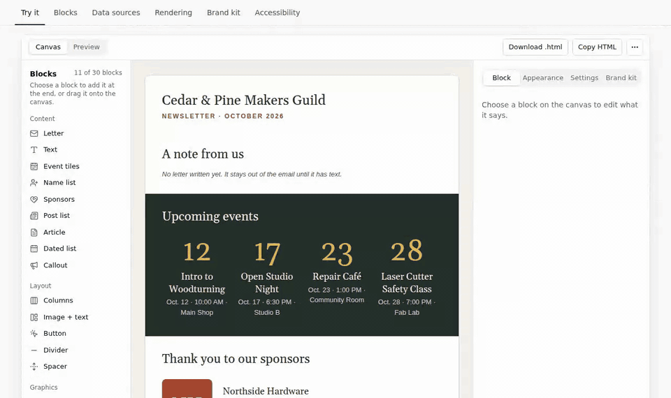
  <br>
  <sub>A new issue fills itself from an organisation's data. Every item stays editable, and a
  picker chooses which events make the cut.</sub>
</div>

## Contents

- [Why Blockletter](#why-blockletter)
- [The demo](#the-demo)
- [A tour](#a-tour)
- [How it works](#how-it-works)
- [Getting started](#getting-started)
- [Documents from other languages and LLMs](#documents-from-other-languages-and-llms)
- [The blocks](#the-blocks)
- [Accessibility](#accessibility)
- [Development](#development)
- [Contributing](#contributing)

## Why Blockletter

- **Issues that assemble themselves.** List blocks fill from your records through a small
  `DataSource` interface. Refresh re-reads them, a picker chooses items, and every word stays
  editable.
- **Email-safe by construction.** Table layout, inline styles, web-safe fonts, absolute links,
  escaped text, sanitised rich text, a hidden preheader, a layout that reflows on phones while
  Outlook keeps its fixed 600px, and a plain-text version of every email.
  [What each client gets](docs/COMPATIBILITY.md).
- **A renderer that runs anywhere.** `renderEmail()` is a pure function with zero dependencies:
  the same document renders the same email in the browser, a Node worker, an edge function or a
  database function.
- **Honest warnings.** Rendering also says what to fix before sending: a missing unsubscribe
  link, an image without alt text, an image that only exists in the browser, or an email long
  enough for mail apps to clip.
- **An accessible editor.** Built to WCAG 2.2 AA and audited automatically at 1440, 768, 390 and
  320px. Every drag-and-drop gesture has a keyboard path, and changes are announced.
- **Undo for every change.** Adding, moving, deleting, editing or refreshing a block, and changing
  the issue's settings, can all be undone and redone from the top bar or with Ctrl+Z (⌘Z), typing
  a burst at a time. Deleting a block asks nothing first: its toast offers Undo.
- **Formatted writing.** Text blocks take bold, italics, links and bulleted or numbered lists, from
  a toolbar or with Ctrl/⌘ + B, I and K. Pasted text keeps those and loses the rest, so what is
  stored is always a few tags the sanitiser passes. `RichTextField` gives your own blocks the same.
- **Your backend, your workflow.** `NewsletterEditor` is a controlled React component. You store
  the documents, images and brand kits, and you decide who approves an issue and how it is sent.
- **Brand kits and templates.** Logo, colours, fonts and contact details restyle every block, and
  every colour pair is checked for contrast. Templates are saved layouts with tokens such as
  `{{monthYear}}`.
- **Extensible.** The 21 built-in blocks use the same `defineBlock` API you use for your own.

## The demo

The demo opens as the editor itself, filling the screen the way it would inside your app: the
palette, the canvas and the inspector each scroll on their own, and on a phone it shows one pane at
a time. **Docs**, one click away in its top bar, pairs each explanation and its code with the live
piece it describes, all driven by the issue open in the editor. It opens on _Field Notes_, a
newsletter built from Subterra Technologies' own website; a fictional makers' guild shows every
data-bound block filling itself.

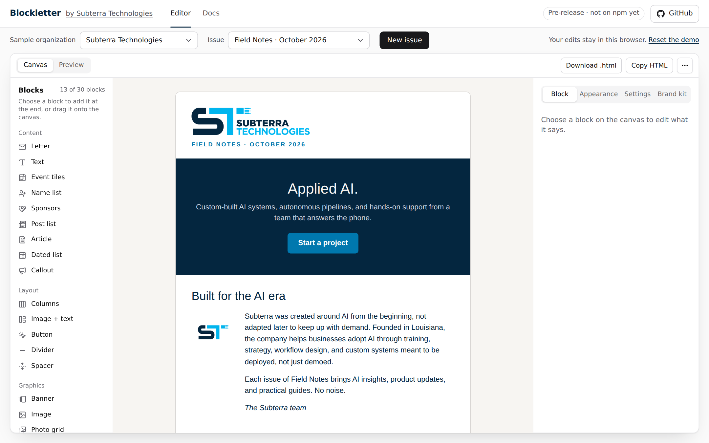

Each link below opens the live demo on a particular view. Running it locally, add the same query
or fragment to `http://localhost:5173/`.

| Try this                                       | Link                                                                                                                    |
| ---------------------------------------------- | ----------------------------------------------------------------------------------------------------------------------- |
| Edit a newsletter                              | [Field Notes, banner selected](https://subterra-technologies.github.io/blockletter/?block=banner)                       |
| Watch an issue assemble itself from data       | [New issue for a makers' guild](https://subterra-technologies.github.io/blockletter/?org=makers-guild&new=1)            |
| Choose which events a data-filled block shows  | [Event tiles and their picker](https://subterra-technologies.github.io/blockletter/?org=makers-guild&block=event_tiles) |
| Restyle every block at once                    | [Brand kit](https://subterra-technologies.github.io/blockletter/?tab=brand)                                             |
| Preview the email at desktop and phone widths  | [Preview](https://subterra-technologies.github.io/blockletter/?view=preview)                                            |
| Use the editor in the dark                     | [Dark theme](https://subterra-technologies.github.io/blockletter/?theme=dark)                                           |
| Read the email exactly as an inbox receives it | [Rendered HTML](https://subterra-technologies.github.io/blockletter/?render=email)                                      |
| …and the plain-text version sent with it       | [Plain text](https://subterra-technologies.github.io/blockletter/?render=text)                                          |
| Read the docs beside the live pieces           | [Docs](https://subterra-technologies.github.io/blockletter/#docs)                                                       |
| See the renderer's output for the open issue   | [Rendering](https://subterra-technologies.github.io/blockletter/#rendering)                                             |

## A tour

### Build an issue from blocks

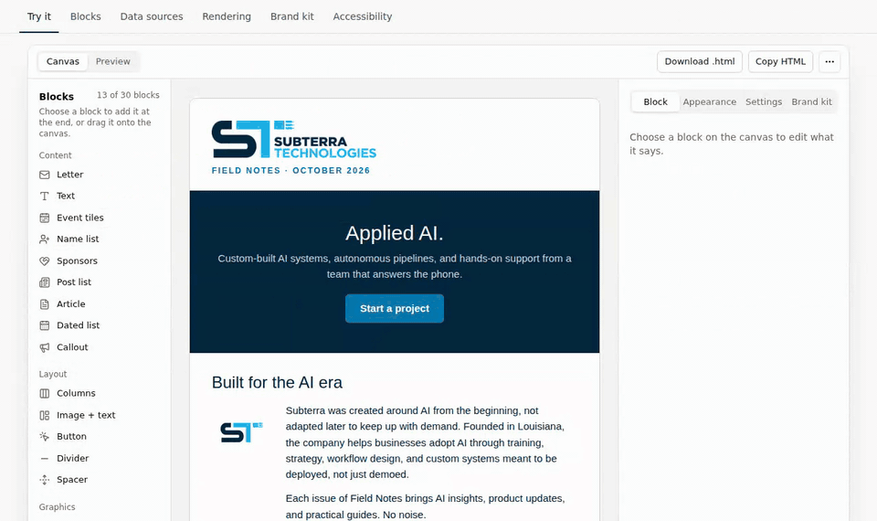

Add blocks from the palette or drag them onto the canvas. Each block has a toolbar to move,
insert next to, hide, duplicate, refresh or delete it, and every one of those works from the
keyboard.

### Fill blocks from your data

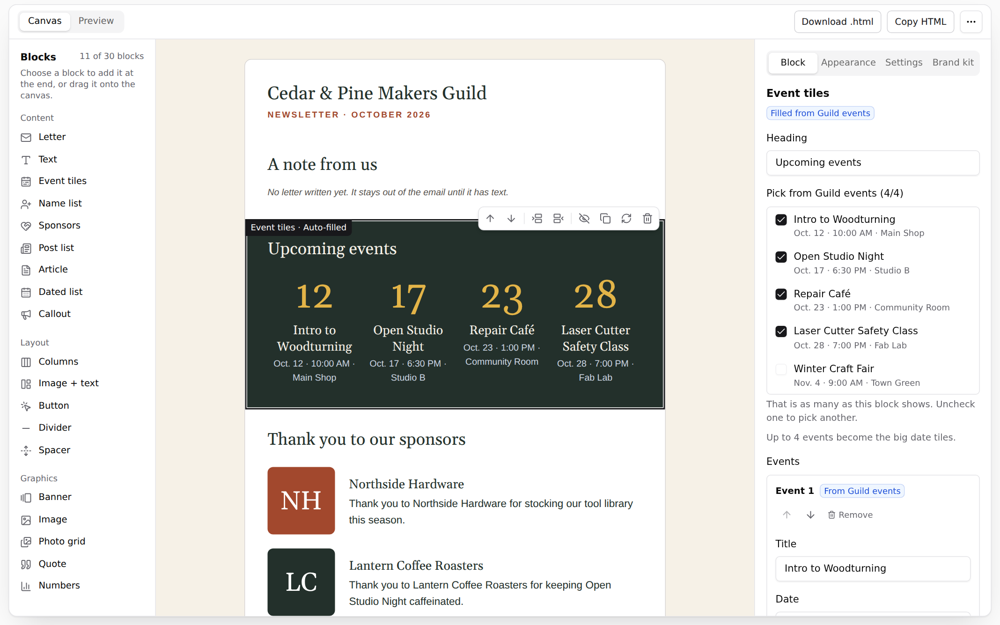

A block that names a data source is _auto-filled_. The inspector lists what the source offers for
the issue's dates; checking and unchecking items updates the block, and items written by hand sit
alongside the sourced ones.

### See exactly what will arrive

<table>
  <tr>
    <td width="64%">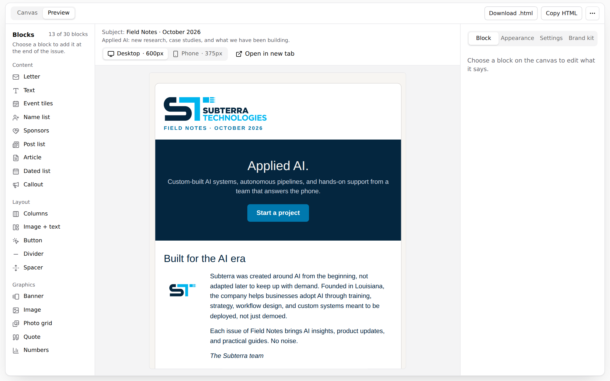</td>
    <td>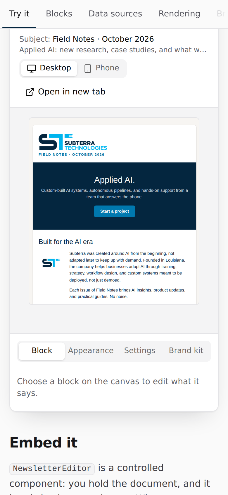</td>
  </tr>
</table>

The preview renders the real email in a sandboxed frame, at 600px for desktop clients and 375px
for phones, and lists any render warnings. Download the HTML or copy it into your email provider.

### Inspect what it produces

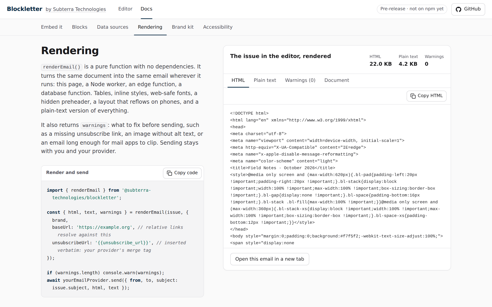

The document is plain JSON, and the renderer returns HTML, a plain-text version and warnings.
The demo shows all four live for whatever issue is open.

### Make it yours

<table>
  <tr>
    <td width="50%">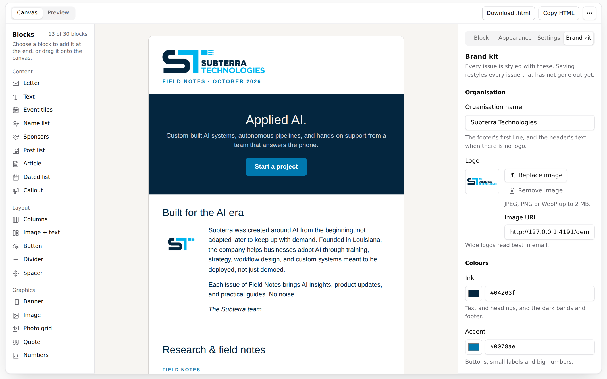</td>
    <td width="50%">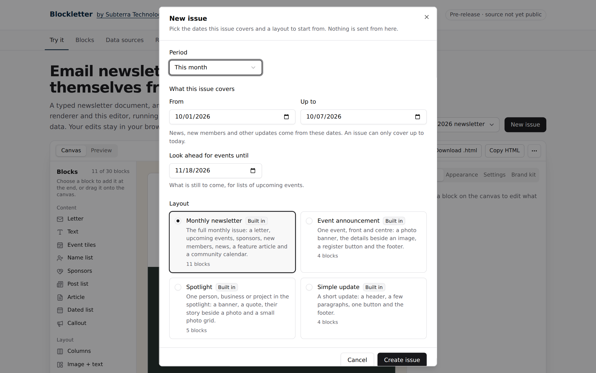</td>
  </tr>
  <tr>
    <td>The brand kit restyles every block at once.</td>
    <td>New issues start from a template, for any period.</td>
  </tr>
</table>

### Phones and dark mode

<table>
  <tr>
    <td width="26%">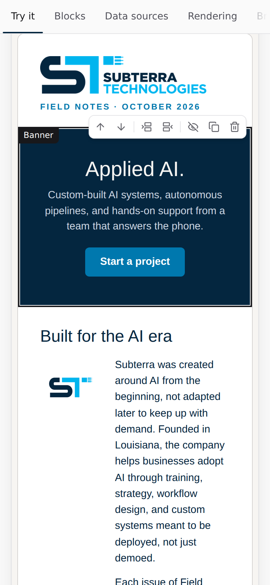</td>
    <td>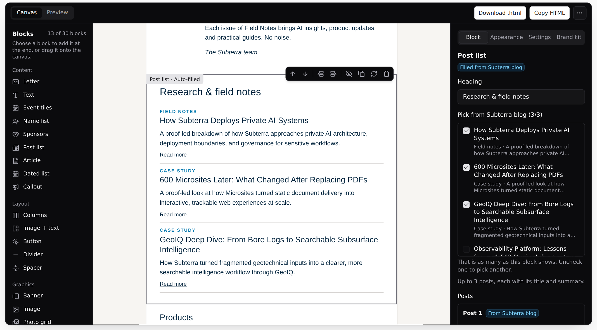</td>
  </tr>
</table>

<details>
<summary><b>The finished email, top to bottom</b></summary>
<br>
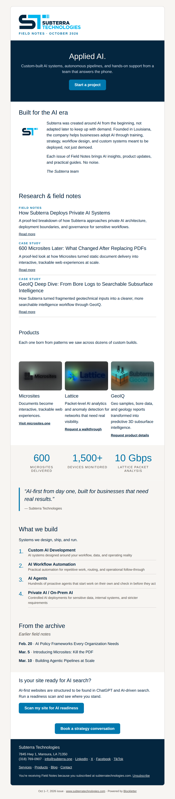

</details>

## How it works

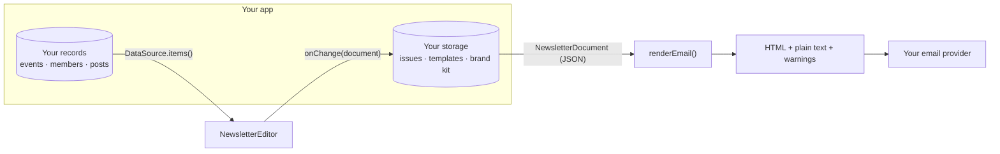

A newsletter is a plain JSON `NewsletterDocument`: a subject, a preheader, the dates it covers and
an ordered list of blocks. Data-filled blocks store a snapshot of what they show, tagged with the
source's ids, so rendering never needs a database and refreshing is always explicit.

| Package                                                      | What it is                                                                                     |
| ------------------------------------------------------------ | ---------------------------------------------------------------------------------------------- |
| [`@subterra-technologies/blockletter`](packages/core)        | Document model, block registry, renderer, brand kit, templates, data sources. No dependencies. |
| [`@subterra-technologies/blockletter-react`](packages/react) | The editor and every part of it, with one compiled, scoped stylesheet.                         |
| [`apps/playground`](apps/playground)                         | The demo site, and the browser tests that keep the editor accessible.                          |

## Getting started

Once the packages are published:

```sh
npm install @subterra-technologies/blockletter @subterra-technologies/blockletter-react
```

### Embed the editor

```tsx
import { NewsletterEditor } from '@subterra-technologies/blockletter-react';
import '@subterra-technologies/blockletter-react/styles.css';

export function IssueEditor({ issue, brand, onSave, onSaveBrand }) {
  const [doc, setDoc] = useState(issue);
  return (
    <NewsletterEditor
      fill // take the container's height, each pane scrolling on its own
      value={doc}
      onChange={setDoc}
      brand={brand}
      onBrandChange={onSaveBrand} // shows the Brand kit tab
      sources={[eventsSource, postsSource]}
      uploadImage={uploadToYourStorage} // (file) => Promise<{ url }>
      renderOptions={{ baseUrl: 'https://example.org' }}
      toolbar={<button onClick={() => onSave(doc)}>Save draft</button>}
    />
  );
}
```

With `fill`, the editor fits whatever height its container has (`calc(100dvh - 4rem)` under a
4rem header, say, or a flex item's share): its top bar stays put and each pane scrolls on its own,
as in the demo. Where it is narrower than 64rem it shows one pane at a time, switched from its top
bar. Leave `fill` out and the editor grows with the issue instead, scrolling with your page.

The editor keeps its own undo history of the documents it hands to `onChange`, so pass them back as
`value` (a copy read back from your database is fine). A document it did not hand out, such as
another issue or a reload, starts the history afresh.

The stylesheet is compiled and scoped to the editor, so your app needs no CSS framework or setup
of its own. Every part (canvas, palette, inspector, preview, brand kit, template picker, dialogs)
is also exported on its own for custom layouts.

### Fill blocks from your data

```ts
import type { DataSource } from '@subterra-technologies/blockletter';

export const eventsSource: DataSource<'event_tiles'> = {
  id: 'events',
  label: 'Our events',
  blockType: 'event_tiles',
  async items({ period }) {
    const events = await db.events.upcoming({ after: period?.end, until: period?.lookaheadEnd });
    return events.map((event) => ({
      ref: event.id, // your id, so a refresh knows which items came from you
      title: event.title,
      date: event.date, // 'YYYY-MM-DD' in your time zone
      time: event.startsAt, // '6:30 PM'
      location: event.venue,
      url: `/events/${event.slug}`,
    }));
  },
};
```

Start an issue from a template and every block that names a source is filled in:

```ts
import { assembleDocument, BUILT_IN_TEMPLATES } from '@subterra-technologies/blockletter';

const issue = await assembleDocument(BUILT_IN_TEMPLATES[0], {
  period: { start: '2026-11-01', end: '2026-11-30', lookaheadEnd: '2027-01-11' },
  brand: myBrandKit,
  sources: [eventsSource, postsSource, sponsorsSource],
});
```

### Render and send it, anywhere

```ts
import { renderEmail } from '@subterra-technologies/blockletter';

const { html, text, warnings } = renderEmail(issue, {
  brand: myBrandKit,
  baseUrl: 'https://example.org', // relative links in the issue resolve against this
  unsubscribeUrl: '{{unsubscribe_url}}', // inserted verbatim: use your provider's merge tag
});

if (warnings.length) console.warn(warnings); // for example, an image with no alt text
await yourEmailProvider.send({ from, to, subject: issue.subject, html, text });
```

### Add your own block

A block is a definition (its fields, defaults, validation and email HTML) plus, for the editor,
an icon and a form. The built-in blocks are written exactly this way.

```ts
import { blockValidator, defineBlock, type BlockBase } from '@subterra-technologies/blockletter';

interface JobBlock extends BlockBase<'job'> {
  title: string;
  location: string;
  url: string;
}

export const jobBlock = defineBlock<JobBlock>({
  type: 'job',
  label: 'Job opening',
  description: 'A role you are hiring for, with an apply button.',
  group: 'content',
  create: () => ({ title: 'Full stack developer', location: 'Remote', url: '/careers' }),
  validate: (block, path) =>
    blockValidator(block, path, 'job').string('title').string('location').string('url').issues,
  render(block, ctx) {
    ctx.text(block.title.toUpperCase(), block.location, `Apply: ${ctx.url(block.url)}`, '');
    return ctx.section(
      block,
      ctx.heading(block.title, { size: 20 }) +
        `<p style="${ctx.bodyStyle()}">${ctx.escape(block.location)}</p>` +
        ctx.button('Apply', block.url),
    );
  },
});
```

```tsx
import {
  builtInEditorBlocks,
  defineEditorBlock,
  EditorFields,
  TextField,
} from '@subterra-technologies/blockletter-react';
import { BriefcaseIcon } from 'lucide-react';

const jobEditorBlock = defineEditorBlock<JobBlock>({
  ...jobBlock,
  icon: BriefcaseIcon,
  Editor: ({ block, onChange, readOnly }) => (
    <EditorFields readOnly={readOnly}>
      <TextField
        label="Title"
        value={block.title}
        onChange={(title) => onChange({ ...block, title })}
      />
      <TextField
        label="Location"
        value={block.location}
        onChange={(location) => onChange({ ...block, location })}
      />
      <TextField
        label="Apply link"
        value={block.url}
        onChange={(url) => onChange({ ...block, url })}
      />
    </EditorFields>
  ),
});

<NewsletterEditor definitions={[...builtInEditorBlocks, jobEditorBlock]} /* … */ />;
// and wherever you render: renderEmail(doc, { definitions: [...builtInBlocks, jobBlock] })
```

A block without a canvas drawing of its own is drawn on the canvas from its email HTML.

## Documents from other languages and LLMs

A document is plain JSON, so a program in any language, or a language model, can write one. The
core package ships JSON Schemas (draft-07) generated from its TypeScript types, with each type's
and field's documentation as its `description`:

| Schema              | Import                                                               |
| ------------------- | -------------------------------------------------------------------- |
| Newsletter document | `@subterra-technologies/blockletter/schema/newsletter-document.json` |
| Newsletter template | `@subterra-technologies/blockletter/schema/newsletter-template.json` |
| Brand kit           | `@subterra-technologies/blockletter/schema/brand-kit.json`           |

A schema checks shape: block types, required fields, field types, colours and dates. It also
rejects properties the types do not declare, so a misspelt field is caught. **A document that
matches the schema must still pass `validateDocument()`** where your app stores or renders it.
That function is the source of truth for the rules the schema leaves out: the 30-block and
5,000-character limits, how many items each list block takes, unique block ids, real calendar
dates and safe image addresses. `validateBrandKit()` does the same for brand kits.

```ts
import { validateDocument } from '@subterra-technologies/blockletter';
import schema from '@subterra-technologies/blockletter/schema/newsletter-document.json' with { type: 'json' };
import Ajv from 'ajv';

const ajv = new Ajv({ allErrors: true });
const matchesSchema = ajv.compile(schema);

if (!matchesSchema(input)) throw new Error(ajv.errorsText(matchesSchema.errors));
const issues = validateDocument(input); // [] once it is ready to render
```

To have a model write an issue, give it the schema as a structured-output response format (or as
a tool's input schema), check its reply the same way, and send any issues back for it to fix:

```ts
// The response format OpenAI-compatible chat APIs take; `model` is whichever one you use.
const request = {
  model,
  messages: [{ role: 'user', content: "Write this month's issue for a community garden club." }],
  response_format: {
    type: 'json_schema',
    json_schema: { name: 'newsletter_document', schema },
  },
};
```

The schema is shaped for these APIs: the root is an object, every object sets
`additionalProperties: false`, no `$ref` carries keywords of its own, and constants are one-value
enums. Their strict, grammar-enforced modes take only part of JSON Schema, though, and a whole
document is past some of their limits: some need every property to be required, and some cap how
many may be optional, where a document has dozens. So for a whole document, pass the schema
where it guides the model rather than binds it (a response format with strict mode off, or a
tool's input schema), and let the checks above catch what it gets wrong.

If your app registers blocks of its own, add a definition for each to the schema's `definitions`
and list it in `definitions.BuiltInBlock.anyOf`.

## The blocks

| Group        | Block              | What it is                                                      |
| ------------ | ------------------ | --------------------------------------------------------------- |
| **Content**  | Header             | Logo or name over a "title · issue" strapline                   |
|              | Letter             | A personal note with a photo and a signature                    |
|              | Text               | A heading and a few paragraphs                                  |
|              | Event tiles ⚡     | Up to four upcoming events as big date tiles                    |
|              | Name list ⚡       | A numbered list of names, such as new members                   |
|              | Sponsors ⚡        | A logo and a thank-you note for each sponsor                    |
|              | Post list ⚡       | Up to three recent posts, each linking out                      |
|              | Article            | A short feature article with an image beside it                 |
|              | Dated list ⚡      | Dated lines for a community calendar                            |
|              | Callout            | A short heading, a sentence or two and a button                 |
|              | Footer             | Contact details, links, and the preference and unsubscribe line |
| **Layout**   | Columns            | Two or three side-by-side cards                                 |
|              | Image + text       | A picture beside a short story, with an optional link           |
|              | Button             | A solid or outline button with a link                           |
|              | Divider · Spacer   | A rule between sections; breathing room                         |
| **Graphics** | Banner             | A wide hero image with a headline over or under it              |
|              | Image · Photo grid | A full-width picture; two to six captioned photos               |
|              | Quote · Numbers    | A pull quote in large type; two to four big figures             |

⚡ can be filled by a data source. Every block also takes its own background, text colour,
alignment, padding, font size, full-width band and divider.

## Accessibility

The editor is built to WCAG 2.2 AA. The demo's browser tests run an automated accessibility audit
at four widths on every change, and nothing scrolls sideways at 320px.

| Key                                                            | On the canvas                                            |
| -------------------------------------------------------------- | -------------------------------------------------------- |
| <kbd>↑</kbd> or <kbd>↓</kbd>                                   | Move between blocks                                      |
| <kbd>Home</kbd> or <kbd>End</kbd>                              | First or last block                                      |
| <kbd>Enter</kbd>                                               | Edit the focused block in the inspector                  |
| <kbd>Alt</kbd> + <kbd>↑</kbd> or <kbd>Alt</kbd> + <kbd>↓</kbd> | Move the focused block: the keyboard path for dragging   |
| Toolbar: _Insert above / below_                                | Set an insertion point, then pick a block in the palette |
| <kbd>Esc</kbd>                                                 | Cancel the insertion point                               |

Anywhere in the editor, <kbd>Ctrl</kbd> + <kbd>Z</kbd> undoes and <kbd>Ctrl</kbd> +
<kbd>Shift</kbd> + <kbd>Z</kbd> or <kbd>Ctrl</kbd> + <kbd>Y</kbd> redoes; on a Mac, <kbd>⌘</kbd> +
<kbd>Z</kbd> and <kbd>⌘</kbd> + <kbd>Shift</kbd> + <kbd>Z</kbd>. Insertions, moves, refreshes,
undos and redos are announced to screen readers, focus follows the work (to the inspector when a
block is picked, back to the canvas when a dialog closes), and the brand kit warns when a colour
pair is too faint to read.

## Development

```sh
git clone https://github.com/Subterra-Technologies/blockletter.git
cd blockletter
npm install
npm run dev        # the demo at http://localhost:5173
npm test           # unit and component tests, every package
npm run test:e2e   # the demo in a real browser, with an accessibility audit
npm run check      # denylist, lint, typecheck, tests, build
```

Requires Node 22+. The packages import each other's source inside the repository, so there is no
build step while you work. `node apps/playground/scripts/capture-media.mjs` regenerates the
screenshots and animations in this README from a running build of the demo.

After changing a type in `packages/core/src/types.ts`, run `npm run schema -w packages/core` to
regenerate the JSON Schemas (it runs TypeScript directly, so it needs Node 22.18 or newer); the
tests fail while a committed schema is stale.

## Contributing

Issues and pull requests are welcome. Read [CONTRIBUTING.md](CONTRIBUTING.md) first, follow the
[code of conduct](CODE_OF_CONDUCT.md), and report security problems privately as described in
[SECURITY.md](SECURITY.md). Questions and ideas belong in
[Discussions](https://github.com/Subterra-Technologies/blockletter/discussions); issues labelled
[good first issue](https://github.com/Subterra-Technologies/blockletter/labels/good%20first%20issue)
are a good place to start.

## Licence

[MIT](LICENSE). Built and maintained by
[Subterra Technologies](https://www.subterratechnologies.com).
